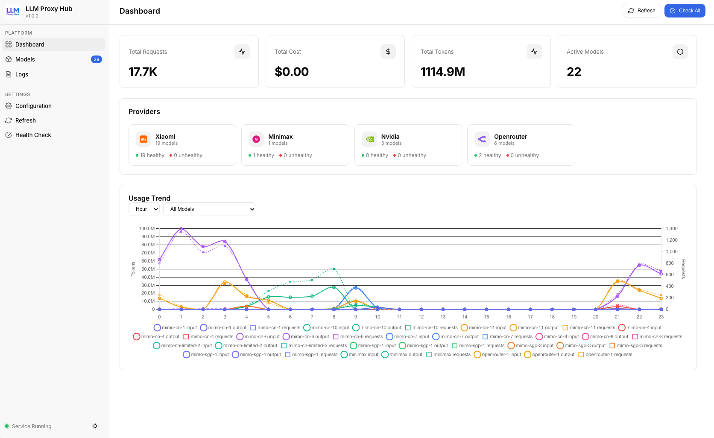
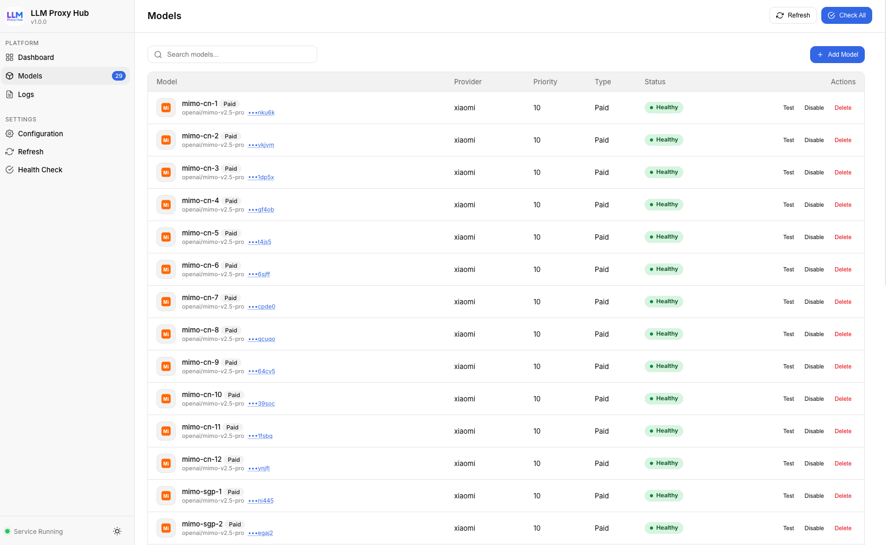
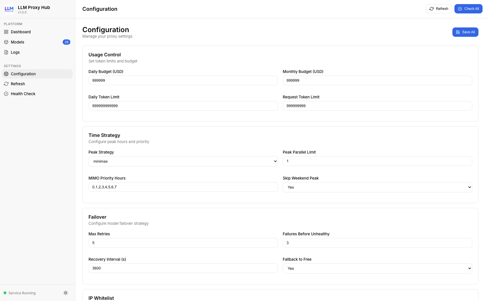
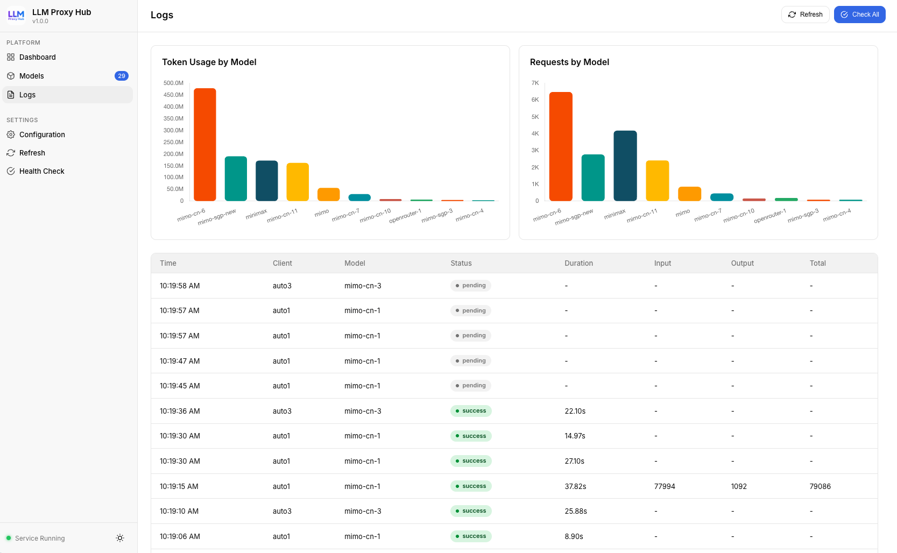

<p align="center">
  
</p>

<h1 align="center">LLM Proxy</h1>

<p align="center">
  A lightweight, high-performance LLM API proxy server
</p>

<p align="center">
  <a href="README_CN.md">中文</a> | English
</p>

<p align="center">
  
  
</p>

---

## Features

- **Multi-Model Management** - Configure multiple LLM providers with a unified OpenAI-compatible endpoint
- **Anthropic API Support** - Native support for Anthropic Claude models with automatic OpenAI ↔ Anthropic format conversion (including streaming)
- **Smart Load Balancing** - Automatically distribute requests across available models
- **Failover** - Detect failures and switch to backup models to ensure availability
- **Auto-Disable** - Automatically disable models after consecutive health check failures
- **Request Logging** - Complete logging of all API requests and responses
- **IP Whitelist** - Fine-grained access control
- **Hot Reload** - Update configuration without restarting the server
- **Web Dashboard** - Intuitive visual management interface with model editing support

## Screenshots

| Dashboard | Model Management |
|-----------|------------------|
|  |  |

| Configuration | Request Logs |
|---------------|--------------|
|  |  |

## Quick Start

### 1. Install Dependencies

```bash
pip install fastapi uvicorn httpx pyyaml
```

### 2. Configure Models

Create or edit `proxy_config.yaml`:

```yaml
models:
  available:
    # OpenAI-compatible model
    my-model:
      api_base: https://api.example.com/v1
      api_key: your-api-key
      enabled: true
      model: model-name

    # Anthropic Claude model
    my-claude:
      api_base: https://api.anthropic.com
      api_key: your-anthropic-key
      enabled: true
      model: claude-sonnet-4-20250514
      provider: anthropic
      api_format: anthropic
```

### 3. Start Server

```bash
uvicorn llm_proxy.server:app --host 0.0.0.0 --port 8000
```

Server will be available at `http://localhost:8000`, with the dashboard at `http://localhost:8000/`.

## API Usage

The proxy is fully compatible with the **OpenAI Chat Completions API** format.

### Chat Completions

**cURL (non-streaming):**

```bash
curl http://localhost:8000/v1/chat/completions \
  -H "Content-Type: application/json" \
  -d '{
    "model": "my-model",
    "messages": [
      {"role": "system", "content": "You are a helpful assistant."},
      {"role": "user", "content": "Hello!"}
    ]
  }'
```

**cURL (streaming):**

```bash
curl http://localhost:8000/v1/chat/completions \
  -H "Content-Type: application/json" \
  -d '{
    "model": "my-model",
    "stream": true,
    "messages": [
      {"role": "user", "content": "Tell me a joke."}
    ]
  }'
```

**Python (OpenAI SDK):**

```python
from openai import OpenAI

client = OpenAI(
    base_url="http://localhost:8000/v1",
    api_key="any-string"  # Proxy handles the real API key
)

response = client.chat.completions.create(
    model="my-model",
    messages=[{"role": "user", "content": "Hello!"}]
)
print(response.choices[0].message.content)
```

**Auto Model Selection:**

Omit the `model` field to let the proxy automatically select an available model:

```python
response = client.chat.completions.create(
    messages=[{"role": "user", "content": "Hello!"}]
)
```

### Management API

```bash
# List available models
curl http://localhost:8000/v1/models

# Proxy status
curl http://localhost:8000/proxy/status

# Health check
curl http://localhost:8000/proxy/health

# Usage statistics
curl http://localhost:8000/proxy/usage

# Request logs
curl http://localhost:8000/proxy/logs
```

## API Reference

| Endpoint | Method | Description |
|----------|--------|-------------|
| `/v1/chat/completions` | POST | Chat Completions compatible API |
| `/v1/models` | GET | List available models |
| `/proxy/status` | GET | Proxy status overview |
| `/proxy/health` | GET | Model health check results |
| `/proxy/usage` | GET | Usage statistics |
| `/proxy/logs` | GET | Request logs |
| `/proxy/config` | GET/PUT | Read or update configuration |
| `/proxy/models/{name}/enable` | POST | Enable a model |
| `/proxy/models/{name}/disable` | POST | Disable a model |
| `/proxy/models/{name}` | PUT | Update a model's configuration |
| `/proxy/models/{name}` | DELETE | Delete a model |
| `/proxy/models/{name}/test` | POST | Test a model connection |

## Project Structure

```
llm_proxy/
├── server.py           # Main server
├── model_manager.py    # Model management & load balancing
├── config_watcher.py   # Config file hot reload
├── health_checker.py   # Model health checks
├── request_logger.py   # Request logging
├── usage_controller.py # Usage control
├── time_controller.py  # Time control
├── proxy_config.yaml   # Configuration file
├── static/             # Frontend static assets
├── images/             # README screenshots
└── logs/               # Log directory
```

## License

MIT
